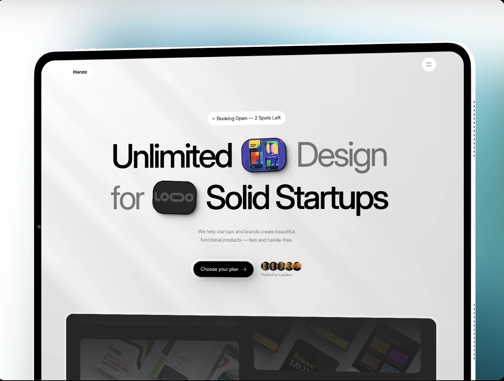

# Hanzo Template Rebuild

This project is a **custom recreation** of the [Hanzo template](https://intuitive-size-957525.framer.app) using **Next.js** and **Framer Motion**.

The original design is a **free template by EasyFast.com**. This project is intended to **rebuild the template as a fully coded web app** while keeping the animations and visual style intact, but with a custom frontend architecture.

---

## Original Template Screenshot

  
*Replace `public/hanzo-template.png` with the actual image file in your project.*

---

## Original Template Link

You can view the original template here:  
[https://intuitive-size-957525.framer.app](https://intuitive-size-957525.framer.app)

---

## Project Purpose

- Recreate the design and animations of the Hanzo template
- Implement interactive components using **Framer Motion**
- Build a maintainable **Next.js project** structure for future customization

---

## Tech Stack

- [Next.js](https://nextjs.org/) (React framework)  
- [Framer Motion](https://www.framer.com/motion/) (Animations)  
- [Tailwind CSS](https://tailwindcss.com/) (Styling)

---

## How to Run Locally

1. Clone the repo:

```bash
git clone https://github.com/your-username/my-framer-site.git